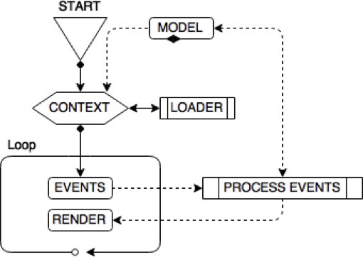
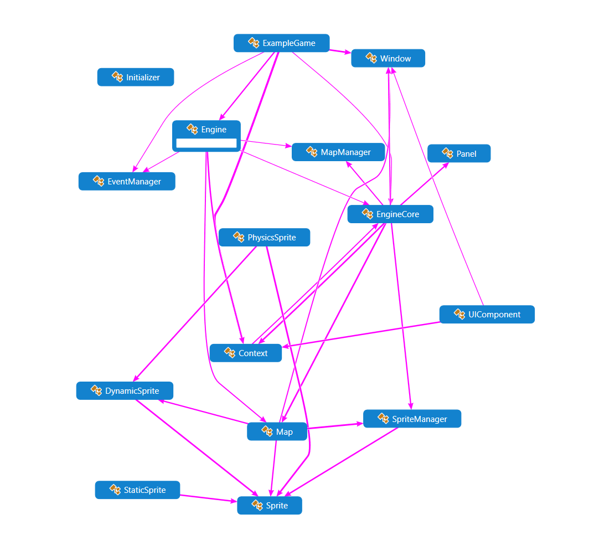

# Little Green Fellow 2D Engine
A 2D engine written to comprehend the underlaying logic behind one. It is more suited for *"retro styled games"* due to its simplicity.

## History
- 2016-03-18

  ```Initial commit```

- 2021-11-01

  ```Minor updates```

## Demonstration
A short video demonstration of a simple game protype.

[Video 1](https://peterborgstedt.s3.eu-north-1.amazonaws.com/demo_1_game_play.mp4) *Game play*

[Video 2](https://peterborgstedt.s3.eu-north-1.amazonaws.com/demo_2_tmx_integration.mp4) *Integration with [Tiled Editor](https://doc.mapeditor.org)*

[Video 3](https://peterborgstedt.s3.eu-north-1.amazonaws.com/demo_3_full_screen.mp4) *Switch to logical fullscreen*

## Engine
*Chart of engine process flow*



### Sprites
Several prepared types of sprites ready to use with different properties and complexity.

Possibility for creating your own types from basic classes.

The core abstract classes for sprites are <u>DynamicSprite.h</u> and <u>Sprite.h</u>, which other types are built upon.

>#### ***Static sprites***
> This type will never be able to change its state. An entity is the same throughout its life. In other words, it will always have the same position on the map.

> #### ***Dynamic sprite***
> This type can change its state. An entity can be changed several times during its lifetime. For example, it may have different positions in the map.

### Collision
Comprehensive tools for collision detection. Several variants from simple rectangular collisions to more complex ones as quad-trees and perfect pixel collisions (with alpha and color key).

### Events
Handling events from I/O, i.e. key and mouse, as well as custom defined events.

### Bind shortcuts
Add key shortcuts to events with your own functions, or function objects (hence lambda).

### FPS
Calculate the number of frames per second (FPS) and set a maximum value, i.e. maximum 60 frames per second (otherwise a delay is added).

### Graphical interfaces
Mainly consisting of a dialogue (with a layout manager) which can contain e.g. label (Label), a button (Button) or a text input (TextInput). The layout manager is based on rows and each row can have zero to several components. If there are more components in the row, they are drawn in columns. Centering and indentations are calculated based on the size of the dialog and the maximum size of the objects in each row.

### Camera
Ability to follow an object when it is moved. A camera consists of all or part of a map. As the player moves, so does the world. Enables the creation of larger paths but where the view is limited to only a small part of the actual area.

### Physics engine
A simple physics engine. A sprite can be affected by gravity, elasticity and friction. Sprites with physics are also affected in contact with each other.

### Supporting formats
 - [TMX](https://doc.mapeditor.org/en/stable/reference/tmx-map-format) (Tiled Map Format)

- [XML](https://en.wikipedia.org/wiki/XML)

## Simplified Codemap


## Third Party Dependencies
### [SDL2]()
*Simple DirectMedia Layer* is a cross-platform development library designed to provide low level access to audio, keyboard, mouse, joystick, and graphics hardware via OpenGL and Direct3D.

### [SDL Image]()
Extension library which allow image file loading.
Load images as SDL surfaces and textures, and supports the following formats: **BMP**, **GIF**, **JPEG**, **LBM**, **PCX**, **PNG**, **PNM**, **SVG**, **TGA**, **TIFF**, **WEBP**, **XCF**, **XPM**, **XV**.

### [SDL TTF]()
Extension library which allows the use of **TrueType** fonts with SDL.
